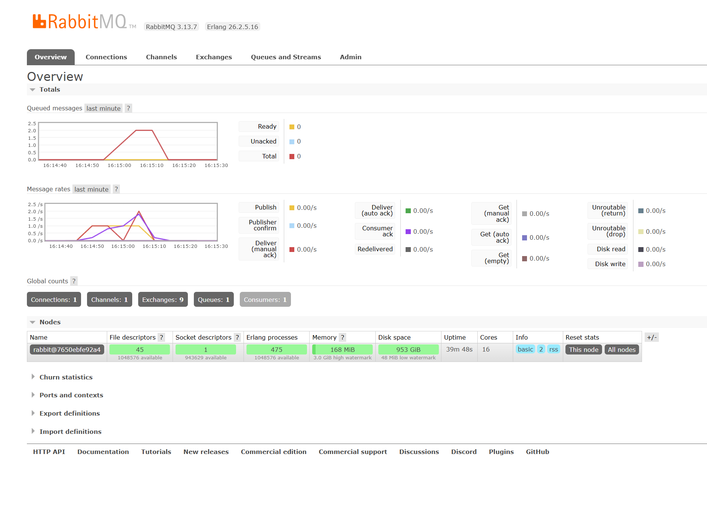
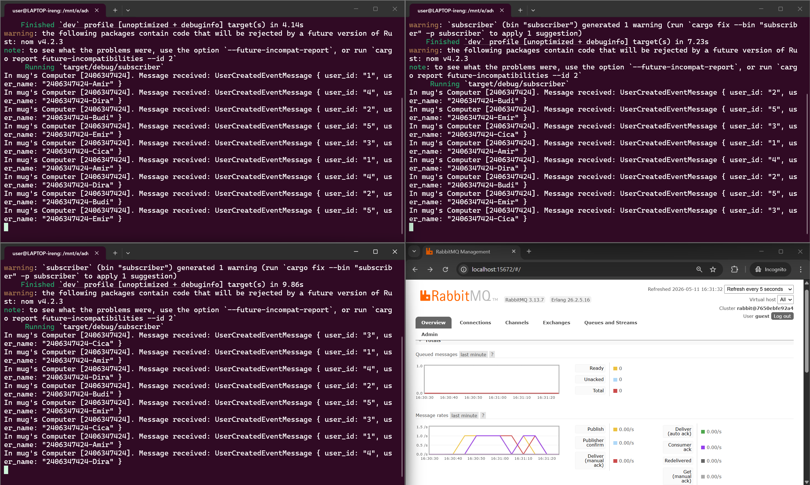

## Event-Driven Architecture: Subscriber and Message Broker

### a. What is amqp?
AMQP (*Advanced Message Queuing Protocol*) adalah sebuah protokol standar terbuka (*open standard*) di *application layer* yang digunakan oleh *message broker* (seperti RabbitMQ). Protokol ini dirancang khusus untuk komunikasi *message-oriented middleware*, memastikan pesan dikirimkan secara aman, andal, dan *interoperable* antar sistem atau aplikasi yang berbeda dalam arsitektur terdistribusi.

### b. What does it mean? `guest:guest@localhost:5672`, what is the first `guest`, and what is the second `guest`, and what is `localhost:5672` is for?
String `guest:guest@localhost:5672` adalah format URL untuk mendefinisikan kredensial dan alamat koneksi ke *message broker* RabbitMQ. Rinciannya sebagai berikut:
* **`guest` (pertama):** Merupakan *username* bawaan (*default*) untuk melakukan autentikasi ke RabbitMQ.
* **`guest` (kedua):** Merupakan *password* *default* untuk *username* tersebut.
* **`localhost:5672`:** Menunjukkan bahwa server RabbitMQ sedang berjalan di *machine* lokal (`localhost`) dan mendengarkan (*listening*) koneksi masuk pada *port* `5672`, yang mana merupakan *port* standar untuk protokol AMQP.

### Simulating Slow Subscriber
 

Berdasarkan gambar grafik pertama, terlihat lonjakan (*spike*) pada *Queued messages* yang memuncak hingga mencapai angka sekitar 20 hingga 25 pesan. Penumpukan ekstrem ini terjadi karena adanya hambatan (*bottleneck*). Program *publisher* dijalankan berkali-kali secara beruntun (mengirimkan sekumpulan pesan secara instan), sementara program *subscriber* tunggal yang ada dibuat berjalan lambat menggunakan simulasi `thread::sleep(1000)`. Karena tingkat produksi data (*publish rate*) jauh melampaui tingkat konsumsi data (*deliver rate*), *message broker* (RabbitMQ) harus menampung sementara pesan-pesan tersebut di dalam antrean, yang direpresentasikan oleh puncak grafik tersebut.

### Running Multiple Subscribers

Ketika kita menjalankan 3 *subscriber* secara bersamaan, kita mengaktifkan pola *Competing Consumers*. RabbitMQ secara cerdas membagi beban antrean pesan secara merata (*round-robin*) ke ketiga *subscriber* tersebut. Hasilnya, *throughput* pemrosesan meningkat secara paralel menjadi tiga kali lipat. Inilah yang menyebabkan tumpukan grafik antrean menurun (*reduced*) ke titik nol jauh lebih cepat dibandingkan saat hanya mengandalkan satu *subscriber* yang lambat.

Penggunaan `std::thread::sleep` dalam ekosistem asinkron seperti Tokio adalah sebuah *anti-pattern* karena ia bersifat *blocking* dan menahan seluruh *worker thread* OS (*thread starvation*). Solusi terbaik untuk diperbaiki ke depannya adalah menggantinya dengan versi *non-blocking* yaitu `tokio::time::sleep`, sehingga *runtime* dapat menjalankan *task* asinkron lainnya secara optimal sembari menunggu waktu *delay* selesai.